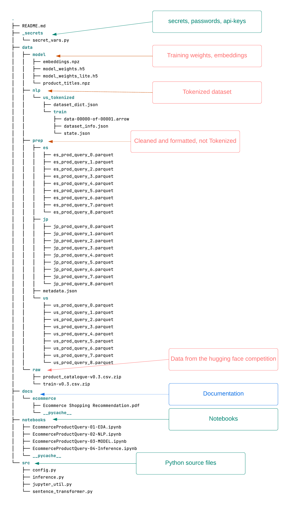

# Springboard Capstone Three Project

### The challenge
How does an ecommerce website know what to show a customer who is searching for a product?  For example, on the Amazon shopping website a customer might search for "pencil with eraser", and the algorythm needs to be able to find the right products to show the customer.

This was the challenge from Amazon who sponsored an AICrowd competition using shopping data provided by Amazon

### This project

This project is loosely based on that Amazon challenge.  We are using the data provided by Amazon, and roughly following the Task 1 challenge.

I started with the dataset of customer queries and a product catalogs provided by Amazon.

I use pretrained transformer from Hugging Face, and a dataset of customer queries and a product catalogs provided by Amazon.

The project builds a sentence to sentence (STS) Tensorflow model using the pretrained sentence transformer.

### Approach

The queries data contain a sample customer query, a product_id and the label - which is a score of how well the query matches the product.  This will be used to create our supervised sentence model.

We also have a product catalog with product titles and descriptions.

We want to merge the queries and product catalog, and create a sentence dataset that contains.

1. The customer query
2. The product title
3. And a score or 'label' that tells us how well the query matches the product.

Once we have built and trained the model on this dataset, we want to see how well out model responds to queries it has never seen.

### Artifacts
Some of the project files are not saved to Github. For example, API keys, and data are ignored.  
Here's a bird's eye view of the entire project

#### Data
This project contains data created at different phases of the project:
1. Downloaded raw data from Hugging Face
2. Cleaned and prepared data for sentence transformer [query, 'product, label]
3. A subset of the US-only tokenized data for the sentence transformer 
4. Saved weights and embeddings from training

#### Notebooks
1.  EcommerceProductQuery-01-EDA  -- contains EDA, wrangling and formatting the data for sentence to sentence training (STS)
2. EcommerceProductQuery-02-NLP -- tokenizes the prepared data and saves the tokenized data and the embeddings
3. EcommerceProductQuery-03-MODEL -- creates our model from the pretrained STS model and saves the weights
4. EcommerceProductQuery-04-Inference -- uses the model to find products based on customer queries

#### Source files

- Supporting python source files

---

